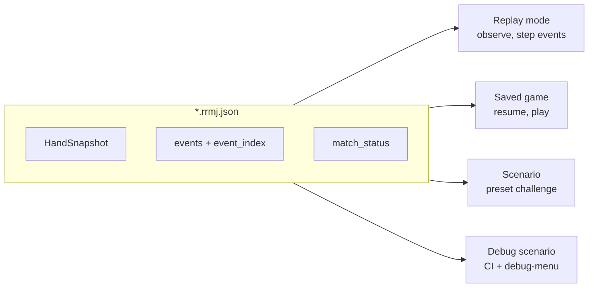

# rrmj — plan

Library-first Rust riichi mahjong: **`librrmj`** (rules engine) + **`rrmj-tui`** (terminal client).

**#1 priority:** **Phase 15** — hand-planning UI (recommendations decomposition, rules examples, dora highlight).

Phases 11 + 12 (full standard rules) and **Phase 14** (recordings, saves, replays, scenarios) are **complete**.

§9 archives Phases 0–10 (engine *plumbing* shipped; **rules are not complete**). §10 is the active backlog. Check boxes in §10 only.

---

## 1. Goals and constraints

### 1.1 Goals

- **Correct riichi rules engine** in `librrmj` — wall, turns, calls, riichi, dora, wins, scoring, match flow.
- **Play vs CPU**: `rrmj-tui` drives a local 4-player match against 3 AI opponents.
- **Online-ready core**: event-sourced, deterministic (`seed` + `Action`/`Event` log); no transport in v0.
- **Thin clients**: all legality and scoring in `librrmj`.
- **Extensible rulesets**: `RulesProfile` boundary; v0 ships **`standard`** only.

### 1.2 Discipline

- Library-first crate split; quality gates in §8.
- Directory modules + sibling `tests.rs` (no tests in logic files).
- `librrmj` has no ratatui/crossterm/clap/toml/bevy.
- Scoring spec: **`docs/RULES.md`** — no licensed third-party reference sheets in repo.

### 1.3 What “done” means for the engine

The **standard profile is not shipped** until all of the following are true:

- Every `cheatsheet.rs` row: `implemented: true`, tested (`WinCase` + scenario where practical)
- Full **fu** breakdown (not the current simplified `fu.rs`)
- Correct **limit hands** and **payments** (dealer/ko, ron/tsumo, honba)
- Call legality complete (kakan, chankan, furiten, …)
- `docs/RULES.md` matches engine behavior

Phases 15+ (hand-planning overlays, TUI polish, online, Bevy) are **out of scope** until Phase 14 is complete.

---

## 2. Repository layout

```text
rrmj/
  librrmj/src/
    tile/  wall/  hand/  action/  event/  state/
    rules/standard/     # yaku, fu, score, cheatsheet.rs, win_combinations/
    scoring/  game/  agent/  replay/  ai/  rng/
  rrmj-tui/src/
    app/  ui/  input/  config/  theme/  cli/
  docs/   PLAN.md  RULES.md  REPLAY.md  DEBUG_SCENARIOS.md
  examples/scenarios/*.json
```

**Crate rules:** `rrmj-tui` builds `Game` from config and calls `apply_action` — never duplicates rule checks.

---

## 3. Core data model (reference)

### 3.1 Rules

| Layer | Role |
| ----- | ---- |
| `RulesProfile` | Yaku set, scoring, draw policies (`rules/standard/`) |
| `RulesConfig` | Tunables within profile (aka dora, kiriage, abortives) |

### 3.2 Hand phases

`Draw` → `Discard` → `Reaction` → (call resolve / rinshan) → … → `HandEnd` / `MatchEnd`

### 3.3 Event log

`Game { seed, rules, events[] }` — append-only; `apply` is pure.

**On disk:** one wire document (`*.rrmj.json`, see `docs/REPLAY.md`) backs **saved games**, **replays**, **scenarios**, and **debug scenarios**. The engine parses the file and restores state; it does not synthesize scenarios in code. Usage mode (play vs observe, CI vs ship) is a **client** concern — see **Phase 14**.

### 3.4 RulesProfile boundary

Yaku, fu, payments, abortives live in `rules/<profile>/`. State machine calls profile hooks — no `if standard` outside `rules/`.

### 3.5 Agent

`Agent::decide(view, legal_actions) → Action`. Human (TUI), CPU (`ai/`), Remote (future).

---

## 4. Rules engine architecture

1. **Primitives** (`tile`, `hand`, `wall`)
2. **Legality** (`state`, `action`) — `legal_actions()`; profile for riichi discard, tenpai, etc.
3. **Scoring** (`rules/standard/`) — `score_win` on `HandEnd`
4. **Match flow** (`game/`) — honba, renchan, match end

**Testing:** `cheatsheet.rs` catalog → `win_combinations/` unit matrix → `examples/scenarios/` CI.

**Per yaku:** detection → han/fu → `WinCase` → `implemented: true` → scenario → `RULES.md`.

---

## 5. AI (shipped — Phase 7–8)

`librrmj/ai/` behind `ai` feature: Easy (random + obvious wins), Medium (shanten), Hard (efficiency + defense).

---

## 6. TUI architecture (reference)

- ratatui + crossterm; hotkeys only; menus show **`legal_actions()`** only.
- Overlays: keybind help (`h`), rules reference (`?`).
- Config: `config.toml`, `keybinds.toml`, `recordings_dir`.
- **Cosmetic work** (themes, animations, display modes, layout) → Phase 16 only.

---

## 7. Online-ready design (future)

Authoritative server replays same `Event` log; wire `Action` + `Event` only. See future `docs/ONLINE.md`.

---

## 8. Quality gates

```bash
cargo fmt --check && typos && cargo deny check licenses
cargo clippy --workspace --all-targets --no-default-features -- -D warnings
cargo clippy --workspace --all-targets --all-features -- -D warnings
cargo test --workspace --no-default-features
cargo test --workspace --all-features
cargo doc --workspace --no-deps
```

**Test discipline:** one `tests.rs` per directory module; integration tests in `librrmj/tests/`.

---

## 9. Shipped phases (archive — Phases 0–10)

> All items below are **complete** unless noted. Do not re-implement. New work is §10.

### Phase 0 — Workspace skeleton ✅

- [x] Workspace `librrmj` + `rrmj-tui`; CI, `deny.toml`, tracing in TUI.

### Phase 1 — Tiles, hand, wall ✅

- [x] `tile/`, `hand/` (concealed + melds), `wall/` (136 tiles, deal, dead wall).

### Phase 2 — Discard flow + turns ✅

- [x] `HandState`, `Draw`/`Discard`/`Pass`, turn rotation, tile conservation tests.

### Phase 3 — Calls ✅

- [x] `Reaction` phase; chi/pon/open kan; priority ron > pon/kan > chi; dora on kan.

### Phase 4 — Wins, yaku, scoring **plumbing only** ✅ (rules NOT complete)

- [x] `RulesProfile`, `RulesRegistry`, win detection, riichi stick, dora/ura/aka hooks.
- [x] Six of ~28 yaku — **the rest is Phase 11**.
- [x] Riichi tenpai-preserving discard (`is_riichi_discard`).
- [x] **Placeholder** fu + limit table — **wrong/incomplete; Phase 11.2–11.3 replaces this**.
- [x] Exhaustive draw payments; profile dispatch only (no rule branches in `state/`).

### Phase 5 — Match flow ✅

- [x] East/south rounds, honba, renchan, dealer rotation, abortive draws, match end.

### Phase 6 — Agent loop + replay API ✅

- [x] `Agent`, `PlayerView`, `Match::apply_action`, in-memory `Replay`, serde groundwork.

### Phase 7 — AI Easy + Medium ✅

### Phase 8 — AI Hard ✅

### Phase 9 — TUI vertical slice ✅

- [x] Main menu, new-game setup, table, call/discard/riichi/win menus, hand result, keybind help.

### Phase 10 — TUI polish baseline ✅

- [x] `config.toml`, CLI paths, text tile glyphs + themes, animation scaffolding, rules overlay (partial content), README.

### Phase 10.1 — TUI infrastructure (partial) ✅ / moved

**Shipped under old 10.1:**

- [x] `MatchRecording` I/O (`docs/REPLAY.md`); round-trip + scenario CI.
- [x] Autosave, Load game (`in_progress` filter), match-end `finished` rewrite.
- [x] Debug menu (`debug-menu` feature); 30 scenarios; `docs/DEBUG_SCENARIOS.md`.
- [x] Win-combination test matrix + `expected_yaku` scenario assertions.
- [x] Pinfu ryanmen detection.

**Not done — moved to active phases:**

| Old item | Now |
| -------- | --- |
| Replays browse/playback | **Phase 14** (was 13.1 interim) |
| Exit table → menu | Phase 13.2 |
| Display modes, layout, animation/theming polish | Phase 16 |
| Rich rules menu, ruleset picker UI | Phase 16 / 13.6 |
| Full scenario catalog | Phase 12.1 |
| Full yaku/fu/rules | **Phase 11 + 12 — ASAP** |

---

## 10. Active phases (roadmap)

### Phase 11 — `librrmj` full standard rules **(do this first)**

> **Goal:** Complete standard Japanese riichi scoring in `librrmj`. Every `cheatsheet.rs` row, correct fu, correct limits. **This should have been Phase 4; it is the urgent core work now.**
>
> **No TUI work** except Phase 12.3 (overlay text sync after `RULES.md`).

#### Phase 11.0 — Test hygiene

- [x] Merge `replay/recording_tests.rs` → `replay/tests.rs`
- [x] Remove `#[cfg(test)] mod tests` from `ai/*/mod.rs`
- [x] Move `game/mod.rs` test helpers → `game/tests.rs`
- [x] Shared fixtures → `librrmj/src/test_util/fixtures.rs` + `librrmj/tests/common/fixtures.rs`
- [x] `win_combinations.rs` → `win_combinations/mod.rs` + `tests.rs`

**Verify:** §8 gates green; no extra test modules in logic files.

#### Phase 11.1 — Calls & legality

- [x] Chi kamicha-only; left/middle/right tests (`state/calls.rs`, `state/reaction.rs`)
- [x] Kakan (pon upgrade), dora reveal, discard after (`action/`, `hand/meld.rs`, `hand_state.rs`)
- [x] Chankan (ron on kakan tile)
- [x] Furiten: riichi furiten, temporary clearing (`state/win.rs`)
- [x] Double/triple ron (per `RulesConfig`)

**Verify:** `legal_actions()` correct; add scenarios in Phase 12.1 as each lands.

#### Phase 11.2 — Fu calculation

Replace `rules/standard/fu.rs` with full breakdown:

- [x] Base 20 fu; open zero-fu pinfu → 30
- [x] Meld fu: simple vs terminal/honor; open vs closed; kan = 4× triplet
- [x] Wait fu: tanki/kanchan/penchan +2; ryanmen +0 (`win.rs` helper)
- [x] Valued pair +2 (seat wind, round wind, dragons)
- [x] Closed ron +10; tsumo +2 (pinfu tsumo exception)
- [x] Chiitoitsu fixed 25 fu
- [x] Round up to 10 (`kiriage`)

**Verify:** table-driven fu tests; existing `WinCase` rows pass.

#### Phase 11.3 — Limits & payments

- [x] Mangan thresholds (5 han / 4 han 40+ fu / 3 han 70+ fu)
- [x] Haneman, baiman, sanbaiman, yakuman bands
- [x] Dealer vs non-dealer; ron vs tsumo; honba sticks
- [x] Table-driven payment fixtures

**Verify:** `rules/standard/score.rs` only; cross-check sample hands manually.

#### Phase 11.4 — Yaku: baseline

- [x] `riichi` — Riichi
- [x] `menzen_tsumo` — Menzen tsumo
- [x] `pinfu` — Pinfu
- [x] `chiitoitsu` — Chiitoitsu
- [x] `yakuhai` — Yakuhai (seat/round wind + dragons)
- [x] `tanyao` — Tanyao (open + closed)

**Verify:** `baseline_cases()` in `win_combinations/tests.rs` asserts yaku set, yaku han, and fu per row; `every_implemented_cheatsheet_row_has_win_fixture`; scenario fixtures for each baseline yaku.

#### Phase 11.5 — Yaku: pattern hands

- [x] `toitoi`
- [x] `iipeikou`
- [x] `ryanpeikou`
- [x] `sanshoku` (open −1 han)
- [x] `ittsu` (open −1 han)
- [x] `honitsu` (open −1 han)
- [x] `chinitsu` (open −1 han)
- [x] `chanta` (open −1 han)
- [x] `junchan` (open −1 han)

**Verify:** `patterns.rs` decomposition + `han_for_yaku`; `pattern_cases()` in `win_combinations/tests.rs`; standard-form pattern yaku supersede chiitoitsu when both apply.

#### Phase 11.6 — Yaku: riichi timing

- [x] `ippatsu` (state: no call/kan between riichi and win)
- [x] `double_riichi` (add `cheatsheet.rs` row; first discard in seat; +2 han)

#### Phase 11.7 — Yaku: win timing

Extend `WinContext` (last tile, first turn, rinshan flag). Depends on 11.1 kakan/chankan.

- [x] `haitei` / `houtei`
- [x] `rinshan`
- [x] `chankan`
- [x] `renhou` (han per `RULES.md`)
- [x] `tenhou` / `chiihou`

#### Phase 11.8 — Yaku: yakuman

- [x] `kokushi`
- [x] `suuankou`
- [x] `daisangen`
- [x] `shousuushii`
- [x] `daisuushii`
- [x] `chuuren`
- [x] `ryuuiisou`
- [x] `suukantsu`

**Verify (Phase 11 complete):** all `cheatsheet.rs` rows `implemented: true`; `every_implemented_cheatsheet_row_has_win_fixture`; CI gate covers all rows (not v0-only).

---

### Phase 12 — Scenarios & rules documentation **(part of “rules done”, not optional)**

> Run **in parallel with Phase 11** — a yaku/call path is not finished until it has tests + `RULES.md` prose + scenario when practical.

#### Phase 12.1 — Scenario catalog gaps

See `docs/DEBUG_SCENARIOS.md`. Minimum still needed:

- [x] Chi: middle, right, kamicha enforcement
- [x] Kan: kakan, chankan
- [x] Ron: double/triple ron
- [x] Furiten: riichi, temporary clearing
- [x] Dora: kan chain, ura, aka on/off
- [x] Scoring: mangan+, honba on table
- [x] Draws: mixed tenpai/noten; abortives (four winds/kongs/riichis)
- [x] Match flow: `match_status = finished` snapshot

Validate: `cargo test -p librrmj --features serde --test scenarios`

**Verify:** `librrmj/tests/scenarios.rs` green; one scenario per catalog row above.

#### Phase 12.2 — `docs/RULES.md`

- [x] Full yaku table (han open/closed)
- [x] Fu algorithm (numbered steps)
- [x] Limit / payment table
- [x] Dora, furiten, abortives, exhaustive draw

**Verify:** prose matches engine tests for every implemented yaku.

#### Phase 12.3 — TUI rules overlay content

- [x] `rrmj-tui/src/ui/rules_content.rs` mirrors `RULES.md` (presentation only)

**Verify (Phase 12 complete):** RULES.md authoritative; scenarios cover §12.1 table; overlay synced.

---

### Phase 13 — TUI functional

> **Blocked on Phase 11 + 12 complete.** TUI already plays games; fix gaps only after the engine scores correctly.

#### Phase 13.1 — Replays menu *(interim — superseded by Phase 14)*

- [x] List `match_status = finished` from `recordings_dir`
- [x] Open for static review (interactive playback → **Phase 14**)

#### Phase 13.2 — Navigation

- [x] Exit table → main menu (tear down `Match`, keybind + `h` entry)

#### Phase 13.3 — Gameplay bugs

- [x] Triage TUI ↔ `librrmj` integration issues; track in `docs/TUI_BUGS.md`

#### Phase 13.4 — Save export

- [x] Pause menu: manual export to user path

#### Phase 13.5 — Debug menu

- [x] Import scenario from filesystem path

#### Phase 13.6 — Ruleset wiring

- [x] `RulesProfileId` in `config.toml` / settings (registry still `standard` only)

#### Phase 13.7 — Recommendations overlay + full win report

> **Goal:** Help the human player plan hands in-match and see a complete scoring breakdown after a win. All yaku / fu / payment logic stays in `librrmj`; TUI is presentation only.

**Engine (`librrmj`)**

- [x] `RulesProfile` hook: enumerate **candidate win paths** for a seat’s current visible hand (concealed + melds, known dora indicators, riichi state) — several closest combinations, each with yaku set, estimated han/fu, and **shanten / tiles-to-tenpai** (or “complete” if winning now).
- [x] Sort API: primary key **expected score** (profile `score_win` estimate at current honba / dealer context); secondary key **closeness** (lower shanten, fewer unique waits).
- [x] Win event surface: attach or emit full `ScoringResult` (yaku names, dora/ura/aka han, fu, per-seat payments, deltas) — not only `Event::Won { han, fu }` totals.

**TUI (`rrmj-tui`)**

- [x] **Recommendations overlay** — open during a match (human seat) on your turn; list top N candidate combinations from the engine hook, scrollable. Default hotkey **`e`** (`overlay.recommendations` in `keybinds.toml`) — **`r` stays Ron** in reaction phase.
- [x] **Full hand result popup** — after a win, show complete report: winner, win type (tsumo/ron), yaku list with han, dora breakdown, fu, limit band, payment table, score deltas (replaces BUG-101 stub).

**Verify:** recommendations match engine yaku detection on fixture hands; win popup matches `score_win` for every `win_combinations` `WinCase` row used in CI; no yaku/fu tables in `rrmj-tui`.

**Verify (Phase 13):** TUI still drives `legal_actions()` only; no duplicated rule logic.

---

### Phase 14 — Recordings, saves, scenarios ✅

> **Goal (shipped):** Four clear **usage modes**, one **parse-only** wire format, no programmatic scenario builders in `librrmj`. Committed JSON under `examples/scenarios/` is the source of truth; CI and TUI load via `MatchRecording::from_json` only.

#### Phase 14.0 — Terminology (four modes, one document)

| Mode | What it is | Player decides? | Where it starts | Typical source |
| ---- | ---------- | --------------- | --------------- | -------------- |
| **Replay** | Watch a completed game from the first event to the last | **No** — observe only | Event `0` (or seek) | User `recordings_dir`, `match_status = finished` |
| **Saved game** | Resume a match that was interrupted mid-play | **Yes** — human seat + CPUs | Saved `HandSnapshot` + `event_index` | **Manual save only**; `match_status = in_progress` |
| **Scenario** | Preset study / challenge (“win hand X in Y turns”) | **Yes** (usually) | As authored in the file | User path or community `scenarios_dir` |
| **Debug scenario** | Same wire shape as scenario; **CI + dev UI** only | Yes (dev testing) | As authored | Repo `examples/scenarios/*.json`; **not** in release app build |

**Replay vs saved game on disk:** same schema. Primary discriminator: `match_status` (`finished` vs `in_progress`). When a saved game is played to completion, the client flips to `finished` (rewrite in place or move to replays list — TUI policy). **TUI flow** differs: replay steps events with no `apply_action` from the user; saved game restores and continues the agent loop.

**Scenario vs debug scenario:** same schema for table state + events. Debug files may add an optional **`assertions`** object (`expected_legal_actions`, `expected_yaku`) consumed only by `librrmj` tests — not required for player scenarios.



#### Phase 14.1 — Wire format (`docs/REPLAY.md`)

- [x] Document the four modes above; clarify `match_status` as play vs observe discriminator
- [x] Optional `recording_kind` enum (`replay` \| `save` \| `scenario` \| `debug`) if we need stricter typing than status alone; otherwise status + client path is enough
- [x] Move CI-only fields (`expected_legal_actions`, `expected_yaku`) under an `assertions` object (or `extensions.debug`) — ignored by TUI and player scenarios
- [x] Distinguish **client prefs** (`cpu_step_delay_ms`, timers) from engine state — already optional; document as non-authoritative for replay/scenario restore
- [x] Bump `format_version`; migration note for existing files in `recordings_dir`
- [x] **Authoring rule:** scenarios are edited as JSON (hand, wall, rivers, events, metadata). No Rust builder is the source of truth.

#### Phase 14.2 — `librrmj`: parse, validate, restore — no builders

**Delete (done):**

- [x] Programmatic scenario builder module in `librrmj` (Rust-generated fixtures)
- [x] Regenerate-from-Rust workflow and doc references

**Keep / add:**

- [x] `MatchRecording::from_json` / `validate` / `restore` / `apply_until` — sole entry for fixtures and saves
- [x] `MatchRecording::capture` — TUI only: manual export + finalize on match end
- [x] `RecordingPlayer` (step, seek, play-to-index) for replay mode — engine-side event cursor over `events[]` + derived `Game` snapshots

**Verify:** `librrmj/tests/scenarios.rs` loads **only** `examples/scenarios/*.json`; no Rust code path constructs scenario state except test helpers used *inside* unit tests (not for committed fixtures).

#### Phase 14.3 — TUI: remove autosave

Removed per-step `persist_match` / async autosaves.

- [x] Remove automatic per-step persistence
- [x] **Manual save only** — pause menu export (existing 13.4) writes `in_progress` to user-chosen or default saves location
- [x] On **match end** from an active session: write once with `match_status = finished` → appears in Replays menu
- [x] Update help text / keybind docs (no “autosaves on quit”)
- [x] Config: separate `saves_dir` vs `replays_dir` if useful; or single dir filtered by `match_status` (current model is fine if documented)

#### Phase 14.4 — TUI: replay mode (observe-only)

- [x] Load `finished` recording from replays list
- [x] **Seat picker for viewing** — switch seat to see that hand’s concealed tiles, rivers, melds (full information; not fog-of-war)
- [x] **Step / seek** through `events[]` from the start (play, pause, jump to hand boundary) — no human `apply_action`
- [x] Replace interim static “replay review” snapshot with stepped playback driven by `RecordingPlayer`
- [x] Discards, calls, wins animate or at least advance event-by-event per existing animation scaffolding

#### Phase 14.5 — TUI: saved game mode

- [x] Load game menu: **only** `in_progress` files
- [x] Seat picker → assign human; other seats use `players[]` / `MatchSetup` from file
- [x] Restore `HandSnapshot` at `event_index`; continue normal table loop until `MatchEnded`
- [x] On completion → promote to replay (`finished`) per 14.3

#### Phase 14.6 — TUI: scenarios (player / community)

- [x] Scenarios menu or import path (generalize 13.5 debug import for non-debug use)
- [x] Configurable `scenarios_dir` (community packs); default empty or user-managed — **not** the same as repo `examples/scenarios`
- [x] Load → seat picker → play like saved game; optional `meta.title` / `description` / tags for browsing
- [x] No `expected_*` assertions in UI

#### Phase 14.7 — Debug scenarios (repo, CI, dev build only)

- [x] `examples/scenarios/*.json` — hand-maintained JSON only (50+ files today)
- [x] `librrmj/tests/scenarios.rs` — restore + optional assertion fields
- [x] TUI `debug-menu` feature: list/load same directory for manual UI regression — **not compiled into default release binary**
- [x] `docs/DEBUG_SCENARIOS.md` — catalog + “how to add a scenario” (edit JSON, run CI); **remove** “regenerate from Rust builders”

#### Phase 14.8 — Migration & cleanup checklist

- [x] Confirm every catalog row in `DEBUG_SCENARIOS.md` has a committed JSON file that parses and restores (`committed_scenarios_match_debug_catalog`)
- [x] Grep repo for removed programmatic fixture builder — zero code hits
- [x] Grep repo for removed regenerate workflow — zero code hits
- [x] `REPLAY.md` and `PLAN.md` agree on terminology
- [x] §8 gates green

**Verify (Phase 14):** No scenario state is constructed in `librrmj` for committed fixtures. Autosave gone. Replay cannot submit actions. Saved game → finished replay promotion works once. Debug scenarios run in CI without `debug-menu` feature.

---

### Phase 15 — Hand planning & rules reference **(active)**

> **Goal:** Make recommendations and the `?` overlay teach hand shape — not just yaku names and wait counts. All decomposition logic stays in `librrmj`; TUI renders tiles only.

#### Phase 15.1 — Recommendations: full closest combination

Today the overlay shows shanten, yaku list, han/fu/points, and at most one `Wait: {tile}` — not how the hand groups or which tiles are still missing.

**Engine (`librrmj`)**

- [ ] Extend `WinPathCandidate` (or companion struct) with a **concrete decomposition** for the path: melds / pair / headless tiles from the current visible hand, plus **missing tile(s)** for tenpai or complete.
- [ ] For 1-shanten rows, include the **suggested discard** that reaches tenpai (already simulated in `recommendations.rs`; surface it in the API).
- [ ] Stable, deterministic formatting helper (tile labels / grouped spans) — no scoring logic in TUI.

**TUI (`rrmj-tui`)**

- [ ] Recommendations overlay: each row shows the **exact combination** (hand tiles grouped + missing tiles marked), then yaku / han / fu / points — not name + wait count alone.
- [ ] Scroll line count updated for multi-line paths.

**Verify:** fixture hands in `win_combinations` — top candidate decomposition matches `score_win` yaku for that path; overlay renders without calling yaku/fu tables in `rrmj-tui`.

#### Phase 15.2 — Rules overlay (`?`): combination examples

Today `rules_content.rs` is prose only (yaku table, fu steps, payments) — no illustrated standard shapes.

- [ ] Add a **Combinations** section (or tab) with worked examples: e.g. pinfu (ryanmen wait), tanyao, toitoi, chiitoitsu, honitsu/chinitsu skeleton, yakuhai — using the same tile glyphs as the table.
- [ ] Examples are static reference content (mirror `RULES.md` / `cheatsheet.rs` names); optional cross-links to yaku rows.
- [ ] Scroll / section navigation still works with existing `?` overlay.

**Verify:** every baseline + pattern yaku in `cheatsheet.rs` has at least one example line or points to a shared shape; §8 gates green.

#### Phase 15.3 — Dora highlight in hand

**Not implemented today** — dora indicators render on the wall (`board/wall.rs`); hand/meld tiles use selection/drawn/match styling only. Red fives use aka styling via `tile.is_red()`, not indicator matching.

- [ ] Highlight tiles in **concealed hand and open melds** that count as dora against current indicators (`view.dora_indicators`; aka when `RulesConfig` aka dora on).
- [ ] Reuse `theme.dora_style()` (or a distinct aka-dora variant if needed); must not clash with picker selection / drawn-tile emphasis.
- [ ] Rivers: optional subtle highlight when a discard matches dora (lower priority than 15.3 hand melds).

**Verify:** manual check on `aka_dora_on` / dora scenario fixtures; dora tiles visually distinct at table with multiple indicators.

**Verify (Phase 15):** TUI still presentation-only; no duplicated rule logic in `rrmj-tui`.

---

### Phase 16 — TUI polish (deferred)

> **Blocked on Phase 14 complete.**

#### Phase 16.1 — Display modes

- [ ] `text` / `ascii` / `unicode`; `display_mode` in config; migrate from `ascii_mode`

#### Phase 16.2 — Table layout

- [ ] Seat geometry, spacing, 80×24 readable, scales up

#### Phase 16.3 — Animations

- [ ] Production timing for discard, calls, riichi, draw, win cues

#### Phase 16.4 — Theming

- [ ] Hex colors, expanded style tokens, settings preview

#### Phase 16.5 — Rules UI

- [ ] Richer rules reference than overlay (tabs/search if scope allows)

**Verify:** §8 gates; cosmetic changes do not touch `librrmj`.

---

### Phase 17 — Post-release

#### Phase 17.1 — Replay playback

> **Folded into Phase 14** (recordings model rework). Shipped as stepped replay via `RecordingPlayer`.

#### Phase 17.2 — Online (`rrmj-net`)

- [ ] `docs/ONLINE.md`; wire format; `RemoteAgent`

#### Phase 17.3 — Bevy client (`rrmj-bevy`)

- [ ] New crate; same `Game` boundary; `docs/BEVY_PLAN.md`

#### Phase 17.4 — Additional rulesets

- [ ] New `rules/<name>/` + `RulesProfile` + fixtures + TUI picker

#### Phase 17.5 — Optional

- [ ] Stronger AI (expectimax / neural)

---

## 11. Dependency policy

- Edition 2024; lockfile committed.
- `librrmj`: `thiserror`, `tracing`, `rand`/`rand_chacha`; optional `serde`, `ai`, `proptest`.
- `rrmj-tui`: `ratatui`, `crossterm`, `clap`, `toml`, `tracing-subscriber`.
- Banned in `librrmj`: ratatui, crossterm, bevy, tokio, network stacks.

---

## 12. Document maintenance

- Check off §10 phases here; do not duplicate in chat.
- Yaku changes → `RULES.md` + `cheatsheet.rs` first.
- Replay / save / scenario schema → bump `format_version` in `REPLAY.md`; mode semantics in Phase 14.

---

## Revision history

| Date | Change |
| ---- | ------ |
| 2026-06-12 | **Phase 14 complete:** recordings/saves/replays/scenarios/debug; Phase 15 active |
| 2026-06-12 | **Phase 14 = #1 priority:** recordings/saves/scenarios/debug; renumber 14→15, 15→16, 16→17 |
| 2026-06-12 | Phase 17 (old): recordings rework drafted — superseded by promotion to Phase 14 |
| 2026-06-10 | Drop release/DoD framing; Phase 11+12 = mandatory full ruleset ASAP |
| 2026-06-11 | Hand planning & rules reference (now Phase 15): recommendations, rules examples, dora |
| 2026-06-11 | Renumber: old Phase 14 → 15 (TUI polish), old Phase 15 → 16 (post-release) |
| 2026-06-10 | Restructure: §9 shipped archive (Phases 0–10), §10 active Phases 11–17 with steps |
| 2026-06-10 | Prior rewrite (priority list) — superseded by phase structure |
| 2026-06-08 | Initial plan |
