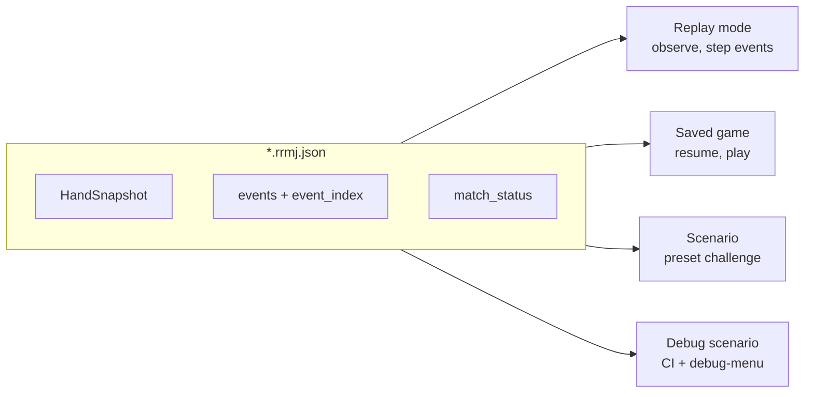

# Match recording format (`*.rrmj.json`)

Version **3** — one parse-only wire document for replays, saved games, scenarios, and debug scenarios.

**Filesystem paths are client-owned** (`rrmj-tui` chooses `recordings_dir` and `scenarios_dir`). `librrmj` only serializes to/from readers and writers; it does not synthesize scenario state in code.

## Usage modes (one schema, four clients)

The same top-level JSON backs every mode. **How the file is used** is determined by the client (menu, path, and `match_status`), not by separate on-disk types.

| Mode | What it is | Player decides? | Where it starts | Typical source |
| ---- | ---------- | --------------- | --------------- | -------------- |
| **Replay** | Watch a completed game from the first event to the last | **No** — observe only | Event `0` (or seek) | `recordings_dir`, `match_status = finished` |
| **Saved game** | Resume a match interrupted mid-play | **Yes** — human seat + CPUs | Saved `HandSnapshot` + `event_index` | Manual save only; `match_status = in_progress` |
| **Scenario** | Preset study / challenge (“win hand X in Y turns”) | **Yes** (usually) | As authored in the file | User path or community `scenarios_dir` |
| **Debug scenario** | Same wire shape; **CI + dev UI** only | Yes (dev testing) | As authored | Repo `examples/scenarios/*.json`; not in release app build |



### `match_status` — play vs observe

| Value | Meaning | Typical mode |
| ----- | ------- | -------------- |
| `in_progress` | Match not finished; client may resume and call `apply_action` | **Saved game**, **scenario** |
| `finished` | Match complete; client steps events for review only | **Replay** |

When a saved game is played to completion, the client sets `match_status = finished` (rewrite in place or move to the replays list — TUI policy).

**Replay vs saved game on disk:** same schema. Menus filter by `match_status` — files are not moved between directories unless the client chooses to.

### `recording_kind` (not used)

An optional `recording_kind` enum (`replay` | `save` | `scenario` | `debug`) is **not** part of the wire format. `match_status` plus client context (which directory / menu loaded the file) is sufficient.

## Authoring rule

**Committed scenarios are edited as JSON** — hand layout, wall, rivers, events, metadata. No Rust builder is the source of truth for `examples/scenarios/*.json`. CI loads files with `MatchRecording::from_json` only.

To add or change a debug scenario: edit the JSON under `examples/scenarios/`, run `cargo test -p librrmj --features serde --test scenarios`.

## Top-level fields

| Field | Type | Required | Notes |
| ----- | ---- | -------- | ----- |
| `format_version` | `u32` | yes | Must be `3` (see [Migration](#migration)) |
| `recording_id` | string | no | Client-generated stable id |
| `created_at` / `updated_at` | string (ISO-8601) | no | Client metadata |
| `client_version` | string | no | e.g. `rrmj-tui 0.1.0` |
| `title` / `description` | string | no | UI labels |
| `tags` | `[string]` | no | e.g. `chi`, `tsumo`, `match-flow` |
| `rules_profile` | string | yes | e.g. `standard` |
| `rules_config` | object | yes | Same schema as `RulesConfig` |
| `seed` | `u64` | yes | Match RNG seed |
| `players` | `[PlayerSetup; 4]` | yes | Seat bindings |
| `human_seat` | `usize` | no | `0`–`3`; recommended for saves and scenarios |
| `cpu_step_delay_ms` | `u64` | no | **Client pref** — see below |
| `turn_timer_ms` | `u64` | no | **Client pref** — discard thinking limit (ms); `0` = off |
| `response_timer_ms` | `u64` | no | **Client pref** — reaction window (ms); `0` = off; alias `reaction_pass_delay_ms` |
| `match_status` | `in_progress` \| `finished` | yes | Play vs observe discriminator |
| `dealer` | `usize` | yes | Current dealer seat |
| `round_wind` | `east` \| `south` | yes | |
| `kyoku` | `u8` | yes | |
| `honba` | `u8` | yes | |
| `scores` | `[i32; 4]` | yes | Cumulative match scores |
| `table_riichi_sticks` | `u8` | yes | Sticks on table between hands |
| `hand_index` | `u32` | yes | Hands dealt so far |
| `match_phase` | `in_hand` \| `ended` | yes | |
| `hand` | `HandSnapshot` | yes | Full tile + flow state |
| `events` | `[Event]` | yes | Complete applied history |
| `event_index` | `usize` | yes | Last applied event index |
| `assertions` | object | no | **CI only** — see below |

### Client preferences (non-authoritative)

These fields affect TUI timing only. They are **not** used to restore engine state; `restore()` ignores them.

| Field | Purpose |
| ----- | ------- |
| `cpu_step_delay_ms` | Pause between CPU decisions |
| `turn_timer_ms` | Human discard thinking limit |
| `response_timer_ms` | Human reaction window for calls |

Omit them in hand-authored scenarios when irrelevant.

### `assertions` (CI / debug scenarios only)

Optional object consumed by `librrmj/tests/scenarios.rs`. **Ignored by the TUI** and player-authored scenario packs.

| Field | Type | Purpose |
| ----- | ---- | ------- |
| `expected_legal_actions` | `[Action]` | After `restore()`, each action must be in `legal_actions()` for the pending seat |
| `expected_yaku` | `[Yaku]` | Score the pending win and assert these yaku are present |

Example:

```json
"assertions": {
  "expected_legal_actions": ["Tsumo"],
  "expected_yaku": ["pinfu", "menzen_tsumo"]
}
```

Versions 1–2 placed these fields at the top level; `from_json` migrates them into `assertions` on read.

## `HandSnapshot`

Contains everything needed to resume mid-hand, including mid-reaction:

- `dealer`, `current_actor`, `phase` (`draw` / `discard` / `reaction` / `ended`)
- `hands` — four seats, concealed tiles + open melds
- `discards` — rivers per seat
- `wall` — `live`, `dead` (14 tiles), `kan_count`, `rinshan_taken`
- `reaction` — optional `{ discarder, tile, responses }` when in reaction phase
- `scores`, `riichi`, `table_riichi_sticks`, `honba` (hand-local copies)
- `last_draw`, `first_discards`, `is_dealer_first_turn`, `end_reason`

Tile conservation (136 tiles) is validated on load.

## `PlayerSetup`

```json
{
  "slot": "human",
  "display_name": "You",
  "ai": { "difficulty": "medium", "personality_seed": 42 }
}
```

`ai` is present when `slot` is `cpu`.

## API (`librrmj`, feature `serde`)

```rust
MatchRecording::capture(&match, &match_setup, human_seat, cpu_step_delay_ms, turn_timer_ms, response_timer_ms, meta);
recording.restore()?;           // lossless Match
recording.apply_until(index)?;  // replay events for regression
recording.to_json() / from_json();
recording.to_writer(&mut w) / from_reader(&mut r);

// Observe-only stepped playback (replay mode)
let mut player = RecordingPlayer::new(recording)?;
player.step_forward()?;         // apply next event
player.step_back()?;            // undo
player.play_to_index(12)?;      // seek
player.seek_hand(1)?;           // jump to second hand
```

`from_json` normalizes legacy v1/v2 files (top-level assertion fields, older `format_version`) before deserialize.

## Client conventions (`rrmj-tui`)

| Directory | Filter | Mode |
| --------- | ------ | ---- |
| `recordings_dir` | `match_status = finished` | **Replays** — observe, step events |
| `recordings_dir` | `match_status = in_progress` | **Load game** — restore and resume |

One directory holds both in-progress saves and finished replays; menus filter by `match_status`. Config key: `recordings_dir` (legacy alias when reading: `saves_dir`). Community scenario packs use a separate `scenarios_dir`; repo CI fixtures live in `examples/scenarios/` (debug menu / `librrmj` tests only).

**Persistence policy (`rrmj-tui`):**

- **In progress:** manual save only — pause menu → **Save game** writes `match_status = in_progress` to a user-chosen or default path under `recordings_dir`.
- **Match end:** one automatic write with `match_status = finished` (same file as the last manual save when set, otherwise `recordings_dir/match-{seed}.rrmj.json`) → appears in **Replays**.
- **Quit / return to menu:** does not write unless you saved manually or the match already ended.

## Migration

| `format_version` | Change |
| ---------------- | ------ |
| **1** | Initial format; top-level `expected_legal_actions` |
| **2** | Added `expected_yaku`; scenarios committed at v2 |
| **3** | Assertion fields moved under `assertions`; documented four usage modes |

**Upgrading files in `recordings_dir`:**

1. Set `"format_version": 3`.
2. If present, move `expected_legal_actions` and `expected_yaku` into an `assertions` object and remove the top-level keys.
3. No engine-state changes required — `hand`, `events`, and `event_index` are unchanged.

`MatchRecording::from_json` performs steps 1–2 automatically for v1/v2 files. Re-save to persist v3 on disk.

## Fixtures

Committed debug scenarios: `examples/scenarios/*.json` — exercised by `librrmj/tests/scenarios.rs` and the TUI debug menu (`debug-menu` feature). See `docs/DEBUG_SCENARIOS.md`.
